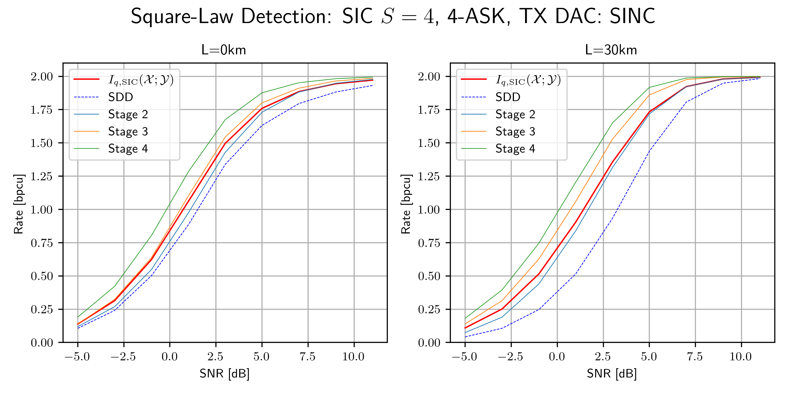
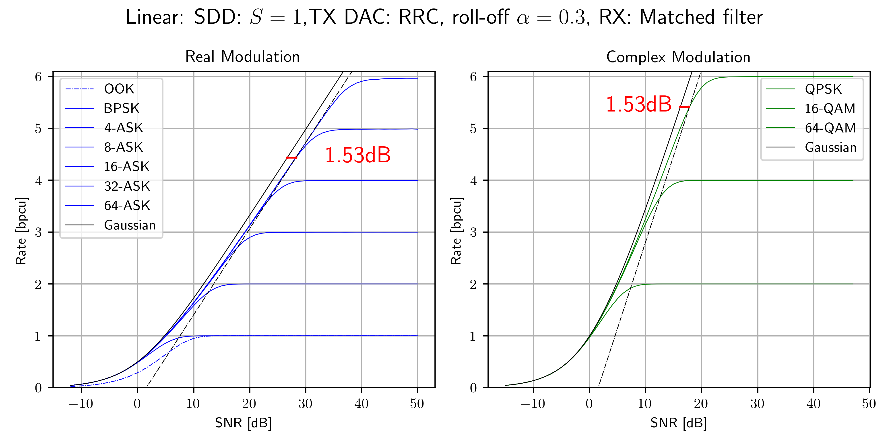
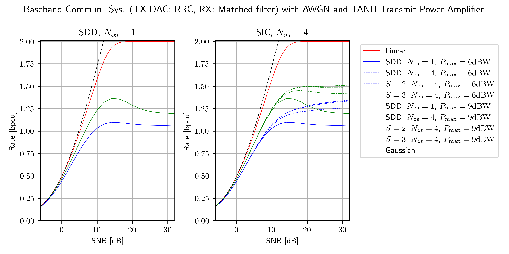

## NN-MI: Neural Network Achievable Information Rate Computation for Channels with Memory

This repository provides the corresponding program code for the submission "Neural Network Equalizers and Successive Interference Cancellation for Bandlimited Channels with a Nonlinearity" to the *IEEE Transactions on Communications* on January, 11, 2024. A pre-print is [available](https://arxiv.org/abs/2401.09217).

The code computes achievable information rates under successive interference cancellation (SIC), where at each SIC stage a recurrent NN estimates (conditional) a-posteriori probabilities.

We provide three example applications.

---

### Citation

The software is provided under the open-source [MIT license](https://opensource.org/licenses/MIT). If you use the software in your academic work, please cite the accompanying document as follows: 

> D. Plabst, T. Prinz, F. Diedolo, T. Wiegart, G. Böcherer, N. Hanik, G. Kramer "Neural Network Equalizers and Successive Interference Cancellation for Bandlimited Channels with a Nonlinearity," CoRR, vol. abs/2401.09217, 2024. [Online]. Available: [https://arxiv.org/abs/2401.09217](https://arxiv.org/abs/2401.09217)

The corresponding BibTeX entry is: [nnmi/cite.bib](nnmi/cite.bib).

 ---

## Example 1: Fiber-Channel with Square-Law Detector

Consider a short-range fiber-optic communication system with a square-law detector (SLD), i.e., the optical-to-electrical conversion is performed by a single photodiode [1,2]. The standard single-mode fiber (SSMF) between transmitter and receiver causes chromatic dispersion and thus introduces intersymbol interference (ISI). The noise models the thermal noise of photodetection.

The continuous-time model is

$$
Y(t) =  h(t) * \left(\left|X(t)\right|^2 + N(t)\right)
$$

with the 
- baseband signal $X(t) = \sum_i X_i  g(t-iT)$  and symbol period $T$
- u.i.i.d. discrete channel inputs $X_i$ from the constellation $\mathcal{A}$ 
- filter $g(t)$ that combines transmit pulseshaping (DAC) and linear fiber effects
- filter $h(t)$ that models linear effects at the receiver
- real white Gaussian noise $N(t)$.

The SLD doubles the signal bandwidth and thus the receive filter $h(t)$ is configured as a brickwall filter with twice the bandwidth of $X(t)$. We oversample $Y(t)$ sufficiently high to obtain sufficient statistics. The oversampled channel outputs are passed to the neural network for further processing.

> Running [example1a_nnmi_v1.0.py](example1a_nnmi_v1.0.py) and
> [example1b_nnmi_v1.0.py](example1b_nnmi_v1.0.py) computes achievable information rates for $L_\text{fib} = 0$ (back-to-back) and $L_\text{fib} = 30 \mathrm{km}$ SSMF, respectively; see [[Tab. II]](https://arxiv.org/pdf/2401.09217.pdf). The fiber is operated at the C band carrier $\lambda = 1550\text{nm}$. The transmit DAC is operated at a symbol rate of $B = 35\mathrm{GBd}$ and performs sinc pulseshaping. We use 4-ASK modulation with constellation $\mathcal{A} = \left\lbrace\pm 1, \pm 3\right\rbrace$. The example considers SIC with $S=4$ stages.
> The figure below plots the SIC stage rates for stages $s=1,\ldots,4$ and the average rate across all stages (red). We set the noise variance $\sigma^2 = 1$ and vary the average transmit power $P_\text{tx}$. Hence $\mathrm{SNR} := P_\text{tx}$. 
>
> 

## Example 2: Linear Baseband Communication System with AWGN

Consider a linear baseband communication system with AWGN. The continuous-time model is

$$
Y(t) =  h(t) * \left(h_\text{ch}(t) * X(t) + N(t)\right)
$$  

with the

- baseband signal $X(t) = \sum_i X_i  g(t-iT)$  and symbol period $T$
- u.i.i.d. discrete channel inputs $X_i$ from the constellation $\mathcal{A}$ 
- RRC filter $g(t)$ with roll-off factor $\alpha$ for transmit pulseshaping
- frequency-selective channel $h_\text{ch}(t)$
- RRC receive matched-filter $h(t)$ 
- circularly-symmetric (c.s.) white Gaussian noise $N(t)$.

### Example 2a: Without ISI 

Consider a flat channel $h_\text{ch}(t)$ that passes $X(t)$ without distortion. The combination of transmit and receive filter is a Nyquist filter. After matched-filtering, sampling at symbol rate results in sufficient statistics. The discrete noise is c.s. discrete AWGN and the overall discrete-time system is memoryless. 

> Running [example2a_nnmi_v1.0.py](example2a_nnmi_v1.0.py) computes achievable information rates for the above model. The equivalent discrete system model is a memoryless channel with c.s. AWGN: 
>
> $$ Y = X + N $$
> 
> and thus, SDD $S=1$ and joint detection and decoding (JDD) achieve the same performance.
The plotted rates are the same as the single-letter mutual information [Fig. 1, 3]. For comparison, we also plot the capacity of the memoryless AWGN channel, achieved by Gaussian signalling. For real modulation, the SNR definition takes only the real component of the noise into account.
> 
> 

### Example 2b: With ISI

Consider the discrete-time ISI channel [4]: 

$$  
Y_\kappa = X_\kappa * h_\kappa + N_\kappa
$$

with the 
- filter $(h_\kappa)_{\kappa=-3}^{3} = (0.19, 0.35, 0.46, 0.5, 0.46, 0.35, 0.19)$
- u.i.i.d. discrete channel inputs $X_\kappa$ from the BPSK constellation $\mathcal{A} = \{\pm 1\}$ 
- real AWGN $N_\kappa$.

This model often describes magnetic recording channels.

_[Results in progress]_

<!-- > Running [example2b_nnmi_v1.0.py](example2b_nnmi_v1.0.py) computes achievable information rates for BPSK inputs $\mathcal{A} = \{\pm 1\}$ and the model (4). We also plot the capacity of the memoryless real AWGN channel. 
>  --> 

## Example 3: Baseband Communication System with AWGN and Nonlinear Transmit Power Amplifier

Consider the baseband communication system with AWGN

$$
Y(t) =  h(t) * \bigg(f(X(t)) + N(t)\bigg)
$$

where the real baseband signal $X(t) = \sum_i X_i  g(t-iT)$ passes through a nonlinear power amplifier (PA)

$$f(x) = \sqrt{P_\mathrm{max}} \cdot
   \tanh\left( \frac{x}{\sqrt{P_\mathrm{max}}} \right)
$$

with peak output power $P_\mathrm{max}$. The remaining parameters are the 
- u.i.i.d. discrete channel inputs $X_i$ from the constellation $\mathcal{A}$  
- RRC filter $g(t)$ with roll-off factor $\alpha$ that performs transmit pulseshaping (DAC)
- receive filter $h(t)$ 
- real-valued white Gaussian noise $N(t)$.

> We consider 4-ASK modulation. Running [example3a_nnmi_v1.0.py](example3a_nnmi_v1.0.py) creates the left subplot below. The receiver performs  matched-filtering, symbol-rate sampling and SDD. We set the noise variance $\sigma^2 = 1$ and vary the average transmit power $P_\text{tx}$ before the PA. Hence $\mathrm{SNR} := P_\text{tx}$. Achievable information rates are computed without PA constraints (red curve), and 9dBW and 6dBW transmit peak powers. 
>
> Running [example3b_nnmi_v1.0.py](example3b_nnmi_v1.0.py) creates the right subplot below. The receiver performs 4-fold oversampling and SIC with up to three stages. For higher transmit powers, $f(x)$ broadens the transmit signal spectrum and oversampling at the receiver increases information rates.
> 
> 

## Usage

One may execute the examples providing command line parameters:

    python3 exampleX_nnmi_v1.0.py -m 4-ASK -S 4

where one must choose an example and replace `X` by `[1a,1b,2a,3a,3b]`. The code then computes achievable rates for $S=4$ SIC stages and 4-ASK modulation and the chosen example, and saves the result as a CSV file. The CSV file lists the average SIC rate and stage rates. 

Further options can be found by executing: 

    python3 exampleX_nnmi_v1.0.py --help

which outputs: 

    usage: exampleX_nnmi_v1.0.py [-h] [--stages STAGES] [--mod_format MOD_FORMAT] [--indiv_stage INDIV_STAGE] [--device {cpu,cuda}]

    NN-MI: Neural Network Achievable Information Rate Computation for Channels with Memory

    optional arguments:
    -h, --help                                 show this help message and exit
    --stages STAGES, -S STAGES                 number of successive interference cancellation stages
    --mod_format MOD_FORMAT, -m MOD_FORMAT     M-ASK, M-PAM, M-SQAM (star-QAM), M-QAM (square) modulation with order M
    --indiv_stage INDIV_STAGE, -s INDIV_STAGE  simulation of a single individual stage
    --device {cpu,cuda}, -d {cpu,cuda}         run code on cpu or cuda

[1] D. Plabst et al., "Achievable Rates for Short-Reach Fiber-Optic Channels With Direct Detection," in *Journal of Lightwave Technology*, vol. 40, no. 12, pp. 3602-3613, 15 June15, 2022, doi: 10.1109/JLT.2022.3149574. [[Xplore]](https://ieeexplore.ieee.org/document/9707620)

[2] T. Prinz, D. Plabst, T. Wiegart, S. Calabrò, N. Hanik and G. Kramer, "Successive Interference Cancellation for Bandlimited Channels with Direct Detection," in *IEEE Transactions on Communications*, to appear. [[Xplore]](https://ieeexplore.ieee.org/document/10328977)

[3] G. D. Forney and G. Ungerboeck, "Modulation and coding for linear Gaussian channels," in IEEE Transactions on Information Theory, vol. 44, no. 6, pp. 2384-2415, Oct. 1998, doi: 10.1109/18.720542.  [[Xplore]](https://ieeexplore.ieee.org/document/720542)

[4] D. M. Arnold, H. . -A. Loeliger, P. O. Vontobel, A. Kavcic and W. Zeng, "Simulation-Based Computation of Information Rates for Channels With Memory," in IEEE Transactions on Information Theory, vol. 52, no. 8, pp. 3498-3508, Aug. 2006, doi: 10.1109/TIT.2006.878110. [[Xplore]](https://ieeexplore.ieee.org/document/1661831)

 ---

### Software Requirements 

The code runs under Python >= 3.9.6 and dependencies [nnmi/requirements.txt](nnmi/requirements.txt):  

    asciichartpy==1.5.25
    matplotlib==3.7.2
    numpy==1.25.2
    scikit_commpy==0.8.0
    scipy==1.11.4
    tabulate==0.9.0
    torch==2.0.1
