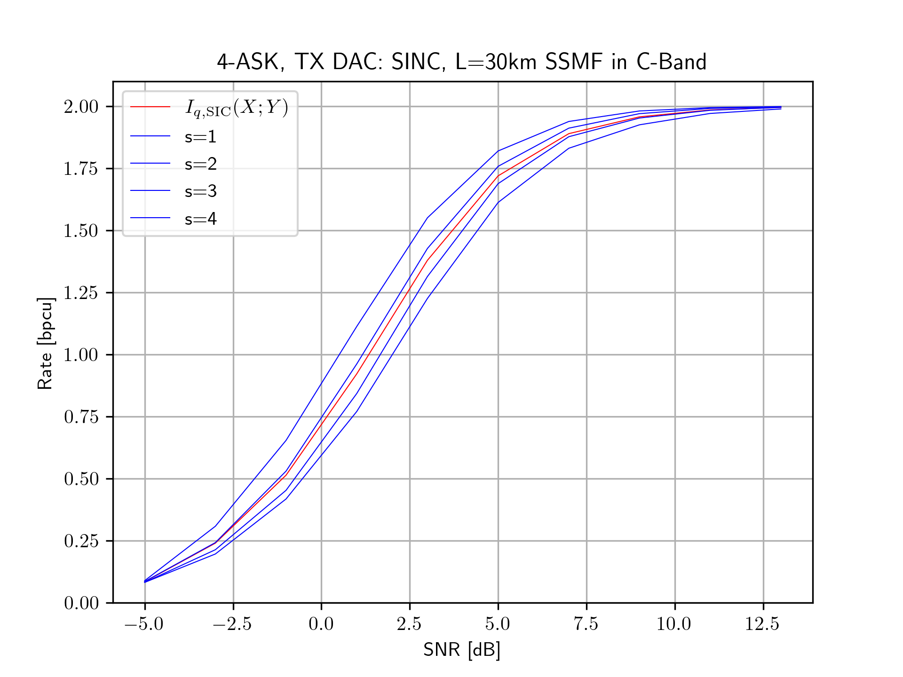

## NN-MI: Neural Network Mutual Information Rate Computation for Channels with Memory

This repository provides the corresponding program code for the submission "Neural Network Equalizers and Successive Interference Cancellation for Bandlimited Channels with a Nonlinearity" to the *IEEE Transactions on Communications*. A copy of the submission is stored in the repository with filename *[arXiv soon]*. <!--(A pre-print is available [here](https://arxiv.org/abs/2004.12148)).-->

The provided functions allow computing mutual information rates for channels with memory. 

*[documentation under construction]*

---

### Citation

The software is provided under the open-source [MIT license](https://opensource.org/licenses/MIT). If you use the software in your academic work, please cite the accompanying document as follows: *[soon]*

<!--
[document](https://doi.org/10.1109/LCOMM.2020.3006921)
> D. Plabst, et. al. "Neural Network Equalizers and Successive Interference Cancellation for Bandlimited Channels with a Nonlinearity," ...

The corresponding BibTeX entry is:

    @online{plabst2023nnmi,
    author = {Daniel Plabst},
    title={NN-MI: Neural Network Mutual Information Rate Computation for Channels with Memory}, 
    year = {2023},
    url={https://github.com/DPlabst/NN-MI},
    urldate = {2024-XX-XX}
    }
-->

 ---

## Example 1: Fiber-Channel with Square-Law Photodetector

The implementation supports the oversampled model [1,2] where the memoryless nonlinearity is applied element-wise:

$$\mathbf{Y} = |\mathbf{H} \mathbf{X}|^{2} + \mathbf{N}$$

and

- $\mathbf{H}$ is a Toeplitz matrix constructed from the transmit DAC and fiber channel
- $\mathbf{X}$ are iid discrete channel inputs and
- $\mathbf{N}$ is (real) white Gaussian noise with unit variance.

## Example 2: Single-Carrier Communication System with Nonlinear Transmit Power Amplifier

*[soon]*

## Example 3: Linear Communication System with Intersymbol Interference

*[soon]*

<!--
Consider the discrete model with a real 1-bit ADC [cite]: 

$$\mathbf{Y} = \sqrt{P_\text{tx}}\cdot \mathrm{sign}{(\mathbf{H} \mathbf{X})} + \mathbf{N}$$

and where

- $P_\text{tx}$ is the average transmit power 
- $\mathbf{H}$ is a sinc Toeplitz precoder matrix
- $\mathbf{X}$ are iid discrete channel inputs and
- $\mathbf{N}$ is (real) white Gaussian noise with unit variance.

It is straightforward to extend the code to other noise distributions, or memoryless nonlinearities. 

-->

## Usage
The file `nnmi_v1.0.py` computes SIC rates for $L_\text{SSMF} = 10\,\mathrm{km}$ standard single-mode fiber (SSMF) operated in the C-band with a square-law detector at the receiver. This setup is described under **Example 1** and accompanying document *[arXiv soon]*. 

The channel matrix $\mathbf{H}$ is a (subsampled) Toeplitz matrix constructed from two-fold oversampling the combined response of the transmit DAC and the SSMF. The transmit DAC is operated at a symbol rate of $B = 35\,GBd$ and performs sinc pulseshaping. The SSMF introduces chromatic dispersion which leads to intersymbol interference. 

The channel inputs $\mathbf{X}$ are u.i.i.d. 4-ASK symbols with constellation $\mathcal{X} = \{\pm 1, \pm 3\}$. We use a SIC-RNN receiver with $S=4$ stages with the settings in [Tab. IV] in the file *[arXiv soon]*.

Running

    python3 nnmi_v1.0.py -m 4-ASK -S 4

computes SIC rates for the **Example 1** under mismatched decoding. The stage rates for stages $s=1,\ldots,4$ (blue) and the average rate across all stages $I_{q,\text{SIC}}(\mathbf{X};\mathbf{Y})$ (red) are displayed in the plot below. 

Further options can be found by executing: 

    python3 nnmi_v1.0.py --help

which outputs: 

    NN-MI: Neural Network Mutual Information Computation for Channels with Memory

    options:
    -h, --help                              show this help message and exit
    --stages STAGES, -S STAGES              number of successive interference cancellation stages
    --mod_format MOD_FORMAT, -m MOD_FORMAT  M-ASK, M-PAM, M-SQAM (star-QAM), M-QAM (square) modulation with order M
    --indiv INDIV, -i INDIV                 simulation of a single individual stage
    --device {cpu,cuda}, -d {cpu,cuda}      run code on cpu or cuda

[1] D. Plabst et al., "Achievable Rates for Short-Reach Fiber-Optic Channels With Direct Detection," in *Journal of Lightwave Technology*, vol. 40, no. 12, pp. 3602-3613, 15 June15, 2022, doi: 10.1109/JLT.2022.3149574. [[Link]](https://ieeexplore.ieee.org/document/9707620)

[2] T. Prinz, D. Plabst, T. Wiegart, S. Calabrò, N. Hanik and G. Kramer, "Successive Interference Cancellation for Bandlimited Channels with Direct Detection," in *IEEE Transactions on Communications*, doi: 10.1109/TCOMM.2023.3337254. [[Link]](https://ieeexplore.ieee.org/document/10328977)

 ---

### Software Requirements 

The code runs with *Python 3.9.6* and the following dependencies `requirements.txt`:  

    asciichartpy==1.5.25
    matplotlib==3.7.2
    numpy==1.25.2
    scikit_commpy==0.8.0
    scipy==1.11.4
    tabulate==0.9.0
    torch==2.0.1
