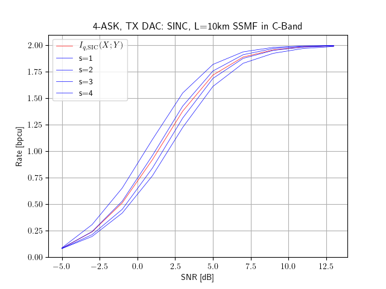

## NN-MI: Neural Network Achievable Information Rate Computation for Channels with Memory

This repository provides the corresponding program code for the submission "Neural Network Equalizers and Successive Interference Cancellation for Bandlimited Channels with a Nonlinearity" to the *IEEE Transactions on Communications*. A pre-print is available [on arXiv soon](https://arxiv.org).

The provided functions compute achievable information rates via successive interference cancellation (SIC). 

*[documentation under construction]*

---

### Citation

The software is provided under the open-source [MIT license](https://opensource.org/licenses/MIT). If you use the software in your academic work, please cite the accompanying document as follows: *[soon]*

<!--
[document](https://doi.org/10.1109/LCOMM.2020.3006921)
> D. Plabst, et. al. "Neural Network Equalizers and Successive Interference Cancellation for Bandlimited Channels with a Nonlinearity," ...

The corresponding BibTeX entry is:

    @online{plabst2023nnmi,
    author = {Daniel Plabst},
    title={NN-MI: Neural Network Achievable Information Rate Computation for Channels with Memory}, 
    year = {2023},
    url={https://github.com/DPlabst/NN-MI},
    urldate = {2024-XX-XX}
    }
-->

 ---

## Example 1: Fiber-Channel with Square-Law Photodetector

Considers the oversampled discrete model [1,2] with a memoryless non-linearity

$$
\begin{align}
\mathbf{Y} = |\mathbf{H} \cdot \mathbf{X}|^{2} + \mathbf{N}
\end{align}
$$

where

- $\mathbf{H}$ is a Toeplitz matrix constructed from the transmit DAC and fiber channel
- $\mathbf{X}$ is a vector with discrete channel inputs and
- $\mathbf{N}$ is (real) white Gaussian noise with unit variance.

Eq. (1) models a short-range fiber-optic communication system with square-law detection, i.e. the optical-to-electrical conversion is performed by a single photodiode. The noise models thermal noise from photodetection.

As an example, the file [example1_nnmi_v1.0.py](example1_nnmi_v1.0.py) computes achievable information rates via SIC for $L_\text{SSMF} = 10\,\mathrm{km}$ standard single-mode fiber (SSMF) operated in the C-band. The receiver performs square-law detection. 

The considered channel matrix $\mathbf{H}$ is a (subsampled) Toeplitz matrix constructed from two-fold oversampling of the combined response of the transmit DAC and the SSMF. The transmit DAC is operated at a symbol rate of $B = 35\,\mathrm{GBd}$ and performs sinc pulseshaping. The SSMF introduces chromatic dispersion which leads to intersymbol interference (ISI). 

The channel inputs $\mathbf{X}$ are u.i.i.d. 4-ASK symbols with constellation $\mathcal{X} = \{\pm 1, \pm 3\}$. We use SIC with $S=4$ stages, where every stage has a recurrent neural network estimate a-posteriori probabilities for mismatched decoding. The whole setup is listed in [[Tab. IV], on arXiv soon](https://arxiv.org). 

The figure below plots the SIC stage rates for stages $s=1,\ldots,4$ (blue) and the average rate across all stages (red).

## Example 2: Single-Carrier Communication System with Nonlinear Transmit Power Amplifier

*[soon]*

## Example 3: Linear Communication System with Intersymbol Interference

*[soon]*

<!--
Consider the discrete model with a real 1-bit ADC [cite]: 

$$\mathbf{Y} = \sqrt{P_\text{tx}}\cdot \mathrm{sign}{(\mathbf{H} \mathbf{X})} + \mathbf{N}$$

and where

- $P_\text{tx}$ is the average transmit power 
- $\mathbf{H}$ is a sinc Toeplitz precoder matrix
- $\mathbf{X}$ are iid discrete channel inputs and
- $\mathbf{N}$ is (real) white Gaussian noise with unit variance.

It is straightforward to extend the code to other noise distributions, or memoryless nonlinearities. 

-->

## Usage

One may execute the example providing command line parameters:

    python3 example1_nnmi_v1.0.py -m 4-ASK -S 4

which computes achievable rates for $S=4$ SIC stages and 4-ASK modulation. 

Further options can be found by executing: 

    python3 example1_nnmi_v1.0.py --help

which outputs: 

    NN-MI: Neural Network Achievable Information Computation for Channels with Memory

    options:
    -h, --help                              show this help message and exit
    --stages STAGES, -S STAGES              number of successive interference cancellation stages
    --mod_format MOD_FORMAT, -m MOD_FORMAT  M-ASK, M-PAM, M-SQAM (star-QAM), M-QAM (square) modulation with order M
    --indiv INDIV, -i INDIV                 simulation of a single individual stage
    --device {cpu,cuda}, -d {cpu,cuda}      run code on cpu or cuda

[1] D. Plabst et al., "Achievable Rates for Short-Reach Fiber-Optic Channels With Direct Detection," in *Journal of Lightwave Technology*, vol. 40, no. 12, pp. 3602-3613, 15 June15, 2022, doi: 10.1109/JLT.2022.3149574. [[Link]](https://ieeexplore.ieee.org/document/9707620)

[2] T. Prinz, D. Plabst, T. Wiegart, S. Calabrò, N. Hanik and G. Kramer, "Successive Interference Cancellation for Bandlimited Channels with Direct Detection," in *IEEE Transactions on Communications*, to appear. [[Link]](https://ieeexplore.ieee.org/document/10328977)

 ---

### Software Requirements 

The code runs under *Python >= 3.9.6* and dependencies `requirements.txt`:  

    asciichartpy==1.5.25
    matplotlib==3.7.2
    numpy==1.25.2
    scikit_commpy==0.8.0
    scipy==1.11.4
    tabulate==0.9.0
    torch==2.0.1
