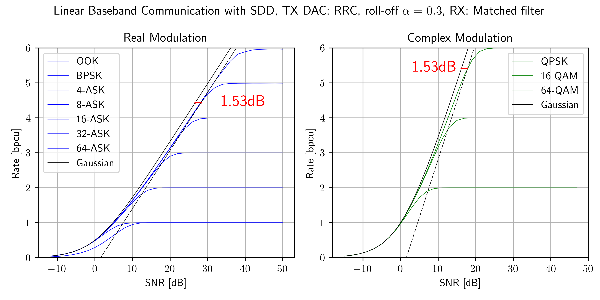
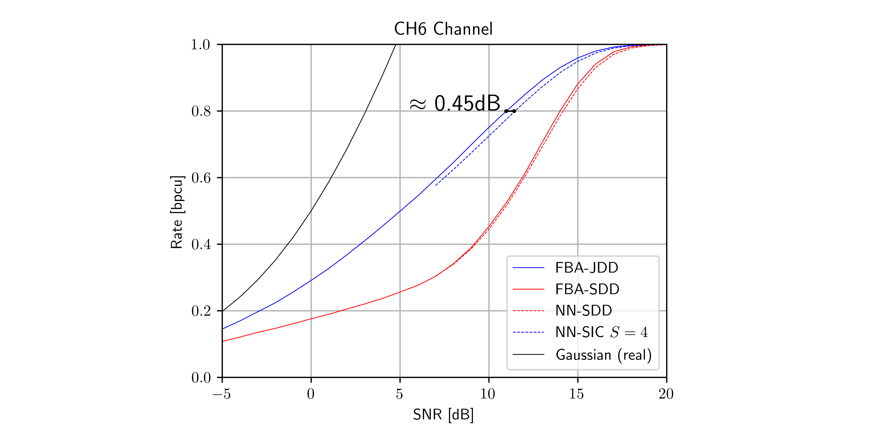
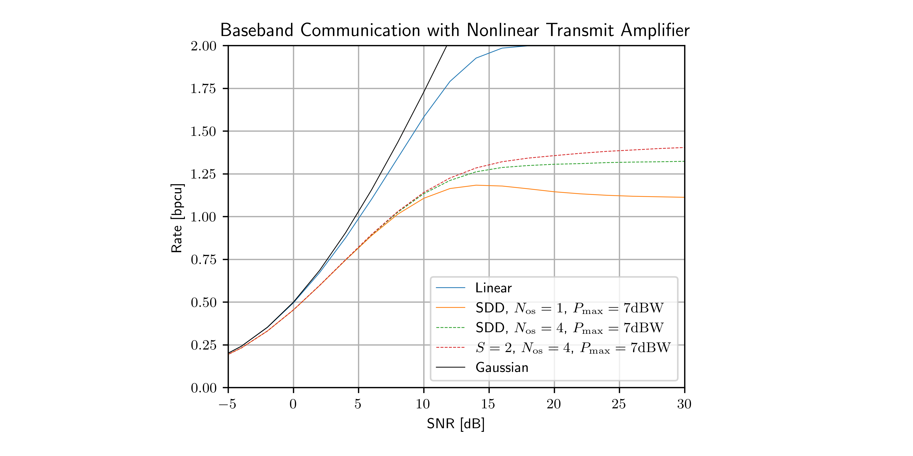

# NN-MI: Neural Network Achievable Information Rate Computation for Channels with Memory

This repository contains the program code for the paper "Neural Network Equalizers and Successive Interference Cancellation for Bandlimited Channels with a Nonlinearity", submitted to the *IEEE Transactions on Communications* on January 11, 2024. A preprint of the submission is [available](https://arxiv.org/abs/2401.09217).

The code computes achievable information rates under successive interference cancellation (SIC). At each SIC stage a recurrent NN estimates (conditional) a-posteriori probabilities.

We provide three example applications.

> [!IMPORTANT]
> The NN parameters have been chosen to work over a wide range of SNRs. Fine-tuning the parameters based on model memory, constellation size or SNR can lead to better performance and faster training.

## Citation

The software is provided under the open-source [MIT license](https://opensource.org/licenses/MIT). If you use the software in your academic work, please cite the accompanying document as follows: 

> D. Plabst, T. Prinz, F. Diedolo, T. Wiegart, G. Böcherer, N. Hanik, G. Kramer "Neural Network Equalizers and Successive Interference Cancellation for Bandlimited Channels with a Nonlinearity," CoRR, vol. abs/2401.09217, 2024. [Online]. Available: [https://arxiv.org/abs/2401.09217](https://arxiv.org/abs/2401.09217)

The corresponding BibTeX entry is: [nnmi/cite.bib](nnmi/cite.bib).

## Example 1: Fiber-Channel with Square-Law Detector

Consider short-range optical communication with a _square-law_ detector (SLD) at the receiver, i.e., a single photodiode performs the optical-to-electrical conversion[^1][^2]. The standard single-mode fiber (SSMF) between transmitter and receiver causes chromatic dispersion, leading to intersymbol interference (ISI). We consider thermal noise from photodetection. The model is

$$
Y(t) =  h(t) * (\left|X(t)\right|^2 + N(t))
$$

with the 
- baseband signal $X(t) = \sum_\kappa X_\kappa  g(t-\kappa T)$  and symbol period $T$
- u.i.i.d. discrete channel inputs $X_\kappa$ from the constellation $\mathcal{A}$ 
- filter $g(t)$ that combines transmit pulseshaping (DAC) and linear fiber effects
- filter $h(t)$ that models linear effects at the receiver
- real white Gaussian noise $N(t)$.

The SLD doubles the signal bandwidth. We use a low-pass filter $h(t)$ with twice the bandwidth of $X(t)$. We oversample $Y(t)$ to obtain sufficient statistics. The samples are passed to the NN-SIC receiver. Due to the receiver squaring operation $|\cdot|^2$, symbol detection becomes a phase retrieval problem. 

We compare two setups.
- [ex1a_nnmi.py](ex1a_nnmi.py) computes information rates for back-to-back configuration (without fiber).
- [ex1b_nnmi.py](ex1b_nnmi.py) computes information rates for 30 km of SSMF.

The fiber is operated at the C band carrier 1550 nm; see [[Tab. II]](https://arxiv.org/abs/2401.09217v1). The DAC is operated at a symbol rate of 35 GBd and performs sinc pulseshaping. We use 4-ASK modulation with constellation $\mathcal{A} = \left\lbrace\pm 1, \pm 3\right\rbrace$. The example program considers NN-SIC with four stages and plots stage rates for $s=1,\ldots,4$ and the average rate across all stages (red). The noise variance is set to $\sigma^2 = 1$ and we vary the average transmit power $P_\text{tx}$. Hence SNR $= P_\text{tx}$. 

## Example 2: Linear Baseband Communication with AWGN

Consider linear baseband communication with AWGN. The model is

$$
Y(t) =  h(t) * \left(h_\text{ch}(t) * X(t) + N(t)\right)
$$ 

with the
- baseband signal $X(t) = \sum_\kappa X_\kappa  g(t-\kappa T)$  and symbol period $T$
- u.i.i.d. discrete channel inputs $X_\kappa$ from the constellation $\mathcal{A}$ 
- RRC filter $g(t)$ with roll-off factor $\alpha$ as the DAC response 
- frequency-selective channel $h_\text{ch}(t)$
- RRC receive matched-filter $h(t)$ 
- circularly-symmetric (c.s.) complex white Gaussian noise $N(t)$.

### Example 2a: No ISI 

Consider a flat channel $h_\text{ch}(t)$ that passes $X(t)$ without distortion. The combination of transmit filter and matched-filter is a Nyquist filter and sampling at symbol rate provides sufficient statistics. The equivalent discrete system is memoryless with c.s. complex AWGN: 

$$ Y = X + N. $$

Separate detection and decoding (SDD) $S=1$ and joint detection and decoding (JDD) are therefore equally good.

Running [ex2a_nnmi.py](ex2a_nnmi.py) uses NN-SIC to compute achievable information rates. The plotted rates are the same as the single-letter mutual information in Fig. 1[^3]. We also plot the capacity of the memoryless AWGN channel, achieved by Gaussian signalling. For real modulation, the SNR definition takes only the real component of the noise into account.

### Example 2b: ISI

Consider the model[^4]: 

$$  
Y[\kappa] = (X * h)[\kappa] + N[\kappa]
$$

with the 
- discrete channel $(h_\kappa)_{\kappa=-3}^{3} = (0.19, 0.35, 0.46, 0.5, 0.46, 0.35, 0.19)$
- u.i.i.d. discrete channel inputs $X_\kappa$ from the BPSK constellation $\mathcal{A} = \lbrace\pm 1\rbrace$ 
- real AWGN $N_\kappa$.

This model often describes magnetic recording channels. The program [ex2b_nnmi.py](ex2b_nnmi.py) uses NN-SIC to calculate the achievable rates. We compare the results with the _exact_ information rates calculated with the forward-backward algorithm (FBA)[^4]. The NN-SDD rates are within 0.1 dB of the FBA reference and NN-SIC with $S=4$ stages is very close to the JDD rate. The JDD rate can be approached by increasing the number of SIC steps. 

 

## Example 3: Baseband Communication with AWGN and Nonlinear Transmit Power Amplifier

Consider baseband communication with AWGN

$$
Y(t) =  h(t) * \big(f(X(t)) + N(t)\big)
$$

where the real baseband signal $X(t)$ passes through a nonlinear power amplifier (PA)

$$
f(x) = \sqrt{P_\mathrm{max}} \cdot \tanh\left( \frac{x}{\sqrt{P_\mathrm{max}}} \right)
$$

with peak output power $P_\mathrm{max}$. The parameters are the 
- baseband signal $X(t) = \sum_\kappa X_\kappa  g(t-\kappa T)$  and symbol period $T$
- u.i.i.d. discrete channel inputs $X_\kappa$ from the constellation $\mathcal{A}$  
- RRC filter $g(t)$ with roll-off factor $\alpha$ that models the DAC
- receive filter $h(t)$ 
- real-valued white Gaussian noise $N(t)$.

We compare two setups. 
- [ex3a_nnmi.py](ex3a_nnmi.py) performs receiver matched-filtering, symbol-rate sampling and SDD. 
- [ex3b_nnmi.py](ex3b_nnmi.py) uses a brickwall receive filter $h(t)$ with cutoff frequency $2/T$ and performs 4-fold oversampling with SIC. 

We consider 4-ASK modulation, set the noise variance $\sigma^2 = 1$ and vary the average transmit power $P_\text{tx}$ before the PA. We define SNR = $P_\text{tx}$. Achievable information rates are plotted without PA constraints (blue) and 7 dBW transmit peak power. For higher transmit powers, the PA significantly broadens the transmit signal spectrum and oversampling with SIC increases information rates.

## Usage

One may execute the examples providing command line parameters:

    python exN_nnmi.py -m 4-ASK -S 4

where one must replace `N` by `[1a,1b,2a,3a,3b]` to choose the example of interest. The prompt example computes achievable information rates for 4-ASK modulation and $S=4$ SIC stages, and saves the result as a CSV file. The CSV file lists the rates pre stage and the average rate under SIC.

Further options can be found by executing: 

    python exN_nnmi.py --help

which outputs: 

    usage: exN_nnmi.py [-h] [--stages STAGES] [--mod_format MOD_FORMAT] [--indiv_stage INDIV_STAGE] [--device {cpu,cuda:0,cuda:1}]

    NN-MI: Neural Network Achievable Information Rate Computation for Channels with Memory

    options:
    -h, --help                                            show this help message and exit
    --stages STAGES, -S STAGES                            number of successive interference cancellation stages
    --mod_format MOD_FORMAT, -m MOD_FORMAT                M-ASK, M-PAM, M-SQAM (star-QAM), M-QAM (square) modulation with order M
    --indiv_stage INDIV_STAGE, -s INDIV_STAGE             simulation of a single individual stage
    --device {cpu,cuda:0,cuda:1}, -d {cpu,cuda:0,cuda:1}  run code on cpu, cuda:0 or cuda:1

[^1]: D. Plabst et al., "Achievable Rates for Short-Reach Fiber-Optic Channels With Direct Detection," in *Journal of Lightwave Technology*, vol. 40, no. 12, pp. 3602-3613, 15 June15, 2022, doi: 10.1109/JLT.2022.3149574. [[Xplore]](https://ieeexplore.ieee.org/document/9707620)

[^2]: T. Prinz, D. Plabst, T. Wiegart, S. Calabrò, N. Hanik and G. Kramer, "Successive Interference Cancellation for Bandlimited Channels with Direct Detection," in *IEEE Transactions on Communications*, to appear. [[Xplore]](https://ieeexplore.ieee.org/document/10328977)

[^3]: G. D. Forney and G. Ungerboeck, "Modulation and coding for linear Gaussian channels," in IEEE Transactions on Information Theory, vol. 44, no. 6, pp. 2384-2415, Oct. 1998, doi: 10.1109/18.720542.  [[Xplore]](https://ieeexplore.ieee.org/document/720542)

[^4]: D. M. Arnold, H. . -A. Loeliger, P. O. Vontobel, A. Kavcic and W. Zeng, "Simulation-Based Computation of Information Rates for Channels With Memory," in IEEE Transactions on Information Theory, vol. 52, no. 8, pp. 3498-3508, Aug. 2006, doi: 10.1109/TIT.2006.878110. [[Xplore]](https://ieeexplore.ieee.org/document/1661831)

## Software Requirements 

The code runs under Python >= 3.9.6 and dependencies [nnmi/requirements.txt](nnmi/requirements.txt):  

    asciichartpy==1.5.25
    matplotlib==3.7.2
    numpy==1.25.2
    scikit_commpy==0.8.0
    scipy==1.11.4
    tabulate==0.9.0
    torch==2.0.1
